# Car Challenge: Simulation and Design

## Final Project Video
This video demonstrates the final cart successfully executing the 10-foot back-and-forth sprint at the maximum safe acceleration on the ME360 classroom floor.

<div align="center">
  <video src="videos/car_final_run.MOV" controls width="80%"></video>
</div>

---

## Overview
The objective of this project was to design, manufacture, and program an autonomous cart capable of moving forward and backward over a distance of 5 to 10 feet as quickly as possible. The primary physical constraint of the competition is that the cart must transport an unattached aluminum bar on its top surface without tipping it over. 

## Kinematic Constraints: Maximum Safe Acceleration
To achieve the fastest possible race time, the cart must operate at the absolute limit of traction and stability. Exceeding a specific maximum acceleration \\(a_{max}\\) will cause the inertial forces to tip the aluminum payload. Here is how the theoretical limit was established and verified.

### 1. Theoretical Kinematics (Analytical Model)
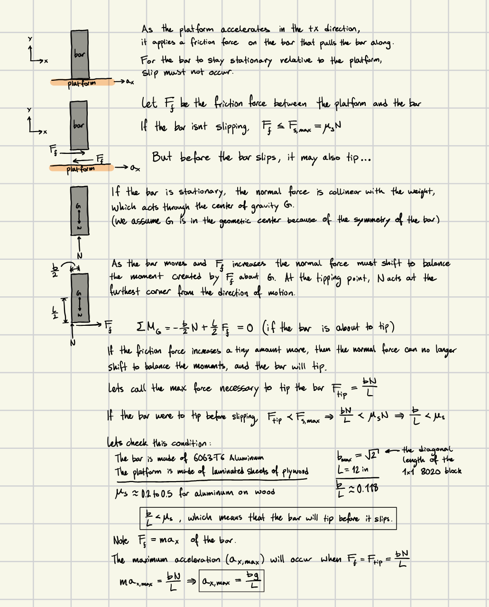
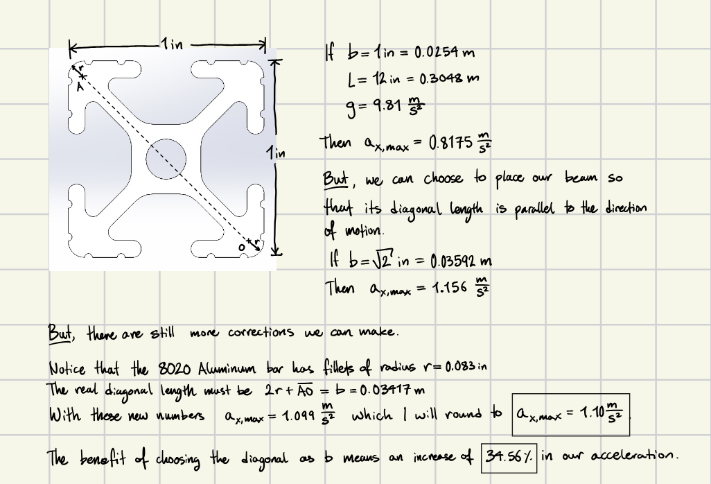

> **Key Insight:** Our analytical model determined that the maximum safe acceleration is **1.10 m/s²**. However, this limit assumes ideal conditions where the bar is oriented perfectly across the cart's diagonal axis to maximize its stabilizing moment arm. It also assumes a perfectly smooth floor, ignoring vertical perturbations from bumps.

---

### 2. SolidWorks Motion Simulation (Numerical Model)
To validate our hand calculations, I constructed a dynamic simulation in SolidWorks.

<div align="center">
  <video src="videos/BackAndForthAnimation.mp4" controls width="80%"></video>
</div>

For the animation above, the cart's theoretical velocity profile looks like this:

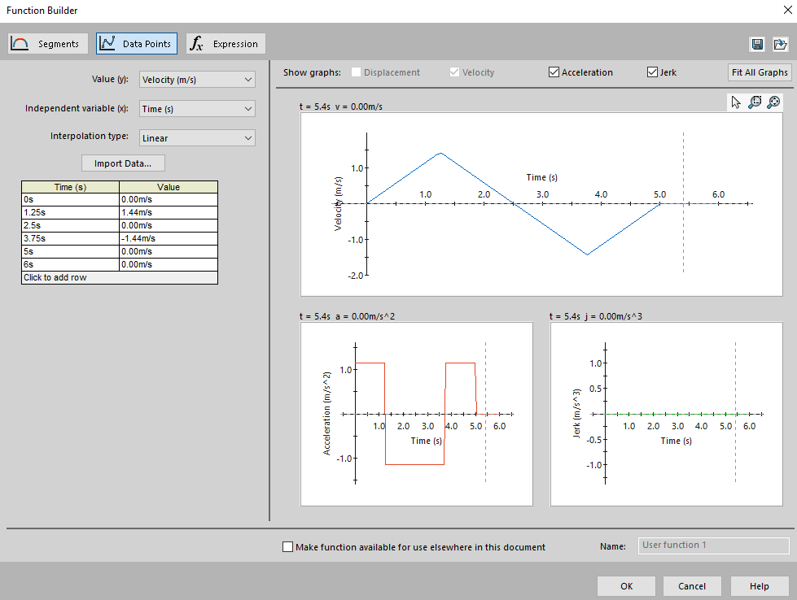

As the cart oscillates between accelerating at \\(+a_{max}\\) and braking at \\(-a_{max}\\), the inertial forces act on the aluminum bar. The plot below maps the normal forces on one of the payload's edges:

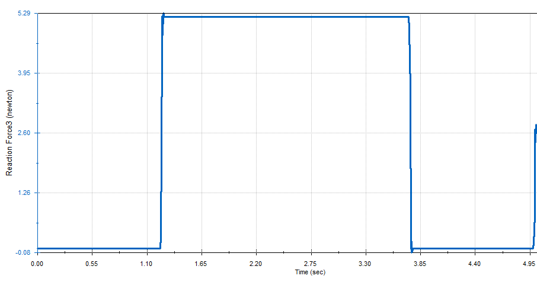

This data aligns perfectly with our expectations: as the cart accelerates and decelerates, the normal force on the edge fluctuates between 0 and the payload's maximum weight. 

To precisely pinpoint the tipping threshold, I ran a simulation where the cart's acceleration increases linearly over time. **The exact moment the normal force on the trailing edge reaches zero is the moment the payload begins to tip.**

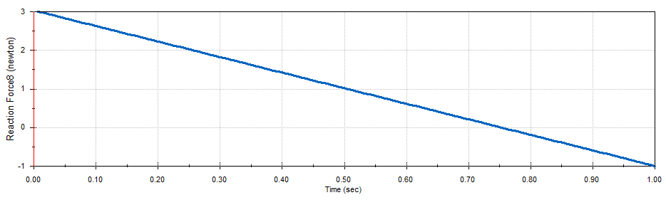

In the graph above, the normal force hits zero at approximately **0.75 seconds**. Given that the simulated acceleration function was \\(a = 1.5t\\) (m/s²), plugging in the time yields a maximum acceleration of roughly **1.12 m/s²**. This numerical simulation confirms our pen-and-paper result of **1.10 m/s²**.

---

## Mechanical Design & Manufacturing

### 1. Wheel Diameter Optimization
With the acceleration limit defined, the next critical parameter was the wheel size, which dictates the cart's maximum top speed (given the motor's RPM limit). 

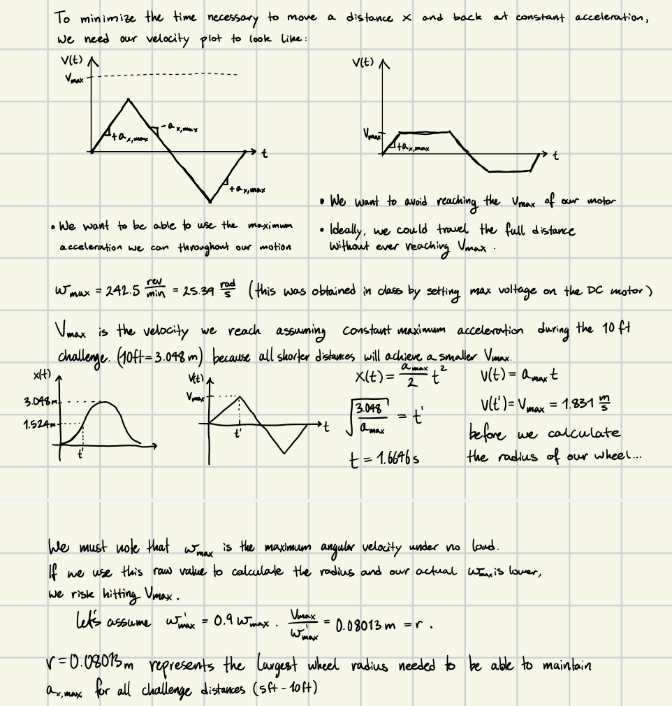

### 2. Underslung Chassis and Center of Gravity
To determine the optimal height of the platform body, I analyzed the effect of the payload's Center of Gravity (CG). 

If the platform is mounted high above the axles, any slight tilt caused by a bump on the floor translates into a massive lateral displacement at the top of the cart. This creates unwanted rotational accelerations that could easily tip the payload. Therefore, the payload deck needed to sit as low to the ground as physically possible.

Because our optimized wheels are quite large (~16 cm), a standard straight axle would place the platform far too high. To solve this, I designed custom underslung axle mounts. 

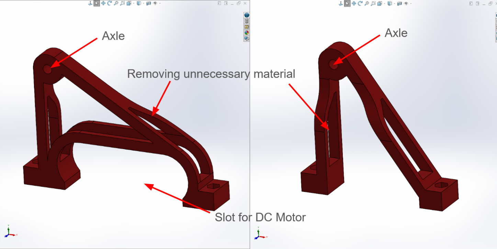

Here is how these mounts allow the main chassis to hang below the axle line, drastically lowering the CG:

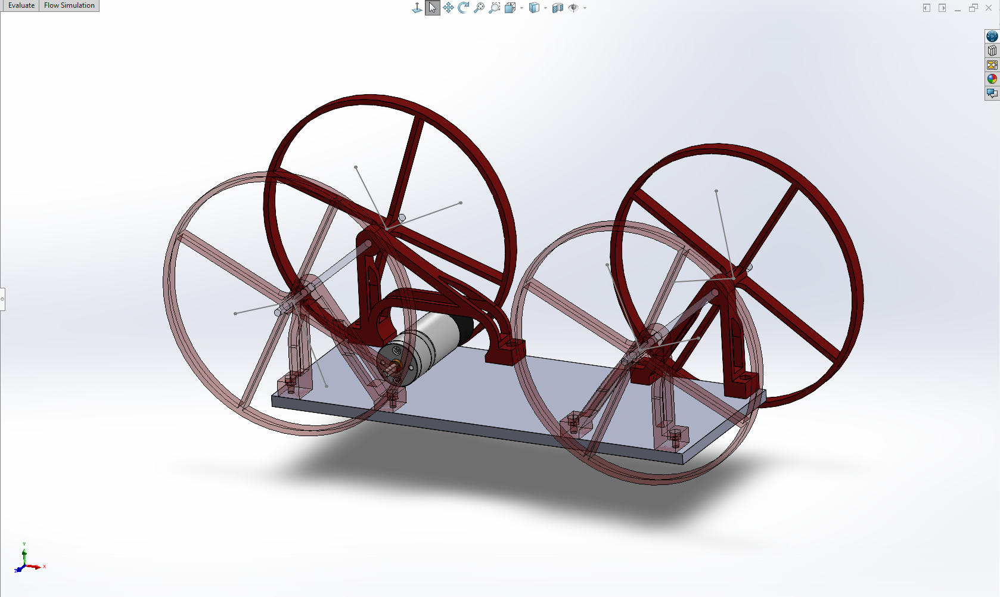

Additionally, I maximized the wheelbase (the distance between the front and rear axles). A longer wheelbase reduces the pitch angle of the cart when it encounters floor irregularities, further isolating the payload from unwanted dynamic forces.

### 3. 3D Printing Tolerance Analysis
To ensure smooth mechanical operation without excessive slop, I conducted a tolerance analysis for the 3D-printed components mating with our 4mm diameter metal axles. I printed several test gauges to empirically determine the best tolerances for my specific printer's extrusion widths.

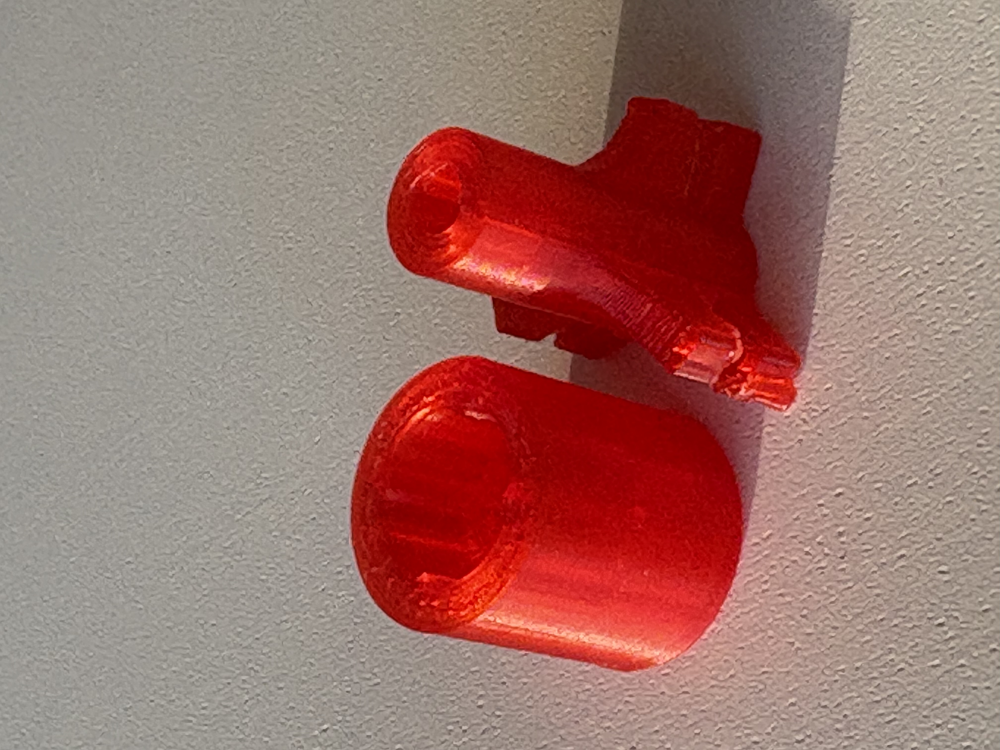

From these test pieces, I determined the required dimensions:
* **Wheel Hubs (Press Fit):** A **4.4 mm** hole provided a secure, tight friction fit for the driven wheels.
* **Axle Mounts (Clearance Fit):** A **4.6 mm** hole provided a smooth, low-friction rotational fit for the axles to spin freely.

### 4. Final Assembly (Design for Manufacturing)
My 3D printer is constrained by a **15cm x 15cm** build plate. Consequently, I had to slightly compromise on the theoretical maximum wheel size, capping the final wheel diameter at exactly **15cm**. Fortunately, as proven in the software section, 15cm wheels still provide a high enough top speed to execute a fast Triangular Velocity profile without clipping the motor's RPM limit.

Here is the final CAD assembly:

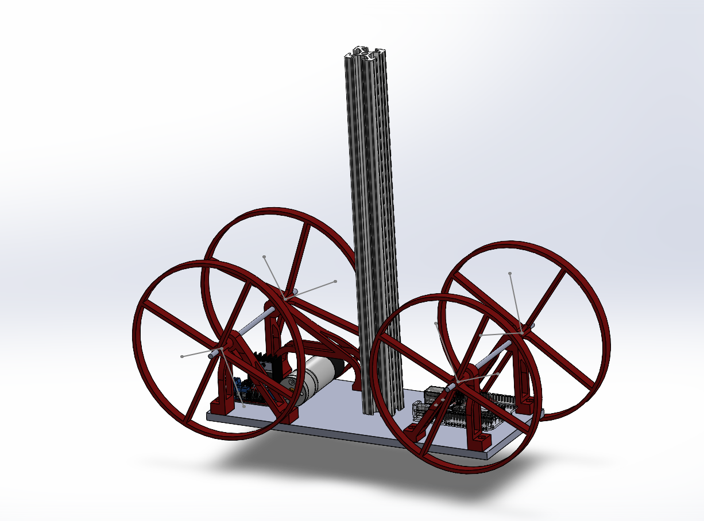

---
## Assembly Pictures and Videos
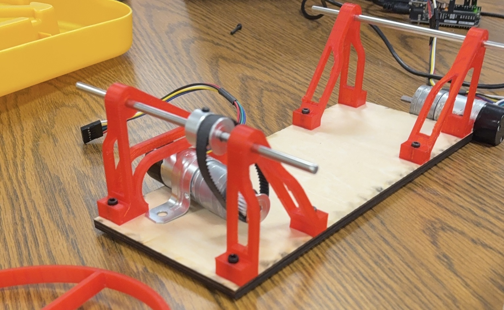

<div align="center">
  <video src="videos/Assem3.MOV" controls width="80%"></video>
</div>
<div align="center">
  <video src="videos/Assem4.MOV" controls width="80%"></video>
</div>

## Motion Control Software: Proportional-Feedforward Profiler

With the mechanical design maximizing our stability and wheel diameter, the final step was controlling the cart's DC motor. To guarantee the fastest possible race time without exceeding the calculated \\(a_{max}\\), I wrote a custom closed-loop motion controller. 

This controller calculates an ideal mathematical "Ghost Cart" trajectory in real-time and uses a feedback loop to force the physical cart to track it.

### 1. Generating the Motion Profile
In the `setup()` function, the code calculates the required time milestones (`T1` through `T5`) before the cart even moves. 

First, I calculate the theoretical maximum velocity if I were to accelerate at \\(a_{max}\\) for the entire first half of the track. Using the kinematic equations for distance and velocity, I find:

$$V_{max,ideal} = \sqrt{a_{max} \cdot d}$$

My logic then handles the profile decision dynamically based on the hardware limits:
`If` \\(V_{max,ideal} > V_{max,limit}\\), `use a trapezoid (cap the speed and include a cruise phase).`
`Else, use a triangle (no cruise phase).`

Because I designed the wheels to be 15cm in diameter, the cart's physical top speed is high enough that the code automatically selects the **Triangular Profile**, saving race time by never having to cruise at a capped speed.

#### The Dwell Time
I also introduced a crucial parameter called `t_dwell`. When the cart hits the turnaround point, instantaneously switching from forward deceleration to reverse acceleration creates massive mechanical jerk, which could tip the aluminum bar. `t_dwell` forces the target velocity to stay at **0 m/s** for **0.5 seconds**, allowing the chassis and payload to settle before launching backward.

### 2. The Main Loop: Real-Time Integration
Inside `loop()`, I calculate the time elapsed since the start (`t`) and the time since the last loop iteration (`dt`). 

Based on `t`, an `if/else` block assigns the proper instantaneous target velocity (`v_target`). For example, during forward acceleration: `v_target = a_max * t;`.

However, my motor is controlled by position (encoder ticks), not velocity. To bridge this gap, I use **numerical integration**. Every loop, I multiply my target velocity by the tiny time slice (`dt`) to find out how far the cart *should* have moved in that millisecond, and add it to a running total:

```cpp
x_target += v_target * dt;
```

This elegantly generates a perfectly smooth target position (`x_target`) for my closed-loop controller to chase.

### 3. The Closed-Loop Controller
To ensure the physical cart perfectly traces my mathematical profile, I use a combined **Feedforward + Proportional (P) Controller**.

1.  **Feedforward (The Guess):** I calculate a baseline PWM signal purely based on `v_target`. If I need to go half speed, I send 50% PWM. This does the heavy lifting.
2.  **Proportional (The Fix):** Friction and battery sag will cause the cart to lag. I convert `x_target` into target encoder ticks, compare it to the actual encoder `counter`, and multiply the difference by a gain (`kp`).
3.  **Combination:** `total_pwm = feedforward_pwm + p_pwm;`

This ensures that if the cart falls behind, the P-controller spikes the voltage to force it back onto the mathematical timeline.

### 4. Hardware Quirks & The H-Bridge Fix
Interfacing with the L298N-style H-Bridge required overcoming a specific hardware quirk regarding directional logic.

The motor speed is dictated by the *voltage difference* between the `DIR_PIN` and `PWM_PIN`.
* **Forward:** `DIR_PIN` is LOW (**0V**). `PWM_PIN` scales from 0 to 255. The math is normal.
* **Reverse:** `DIR_PIN` is HIGH (**5V**). If I send a low PWM like 10, the difference is massive (255 - 10 = 245), causing the motor to violently spike to maximum reverse speed! 

To fix this, when `v_target` is negative, I **invert the PWM signal**:

```cpp
if (total_pwm >= 0) {
  digitalWrite(DIR_PIN, LOW);
  analogWrite(PWM_PIN, final_pwm); 
} else {
  digitalWrite(DIR_PIN, HIGH);  
  analogWrite(PWM_PIN, 255 - final_pwm); // The Inversion Fix
}
```

**The Runaway Cart Bug:**
Similarly, when the sequence is completely finished, sending `analogWrite(PWM_PIN, 0)` while the `DIR_PIN` is still HIGH from the reverse phase causes a 5V difference, launching the cart backwards at full speed forever. I explicitly pull the `DIR_PIN` to LOW at the sequence termination to ensure the voltage difference is a safe 0V.