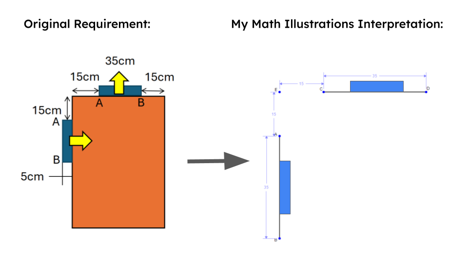
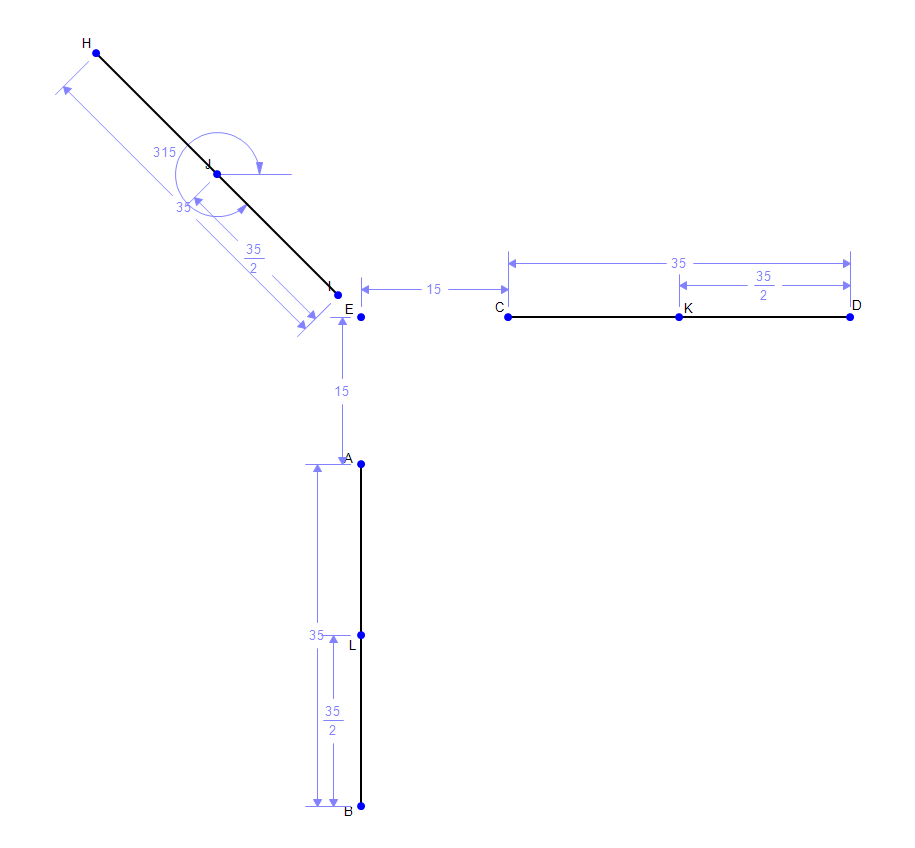
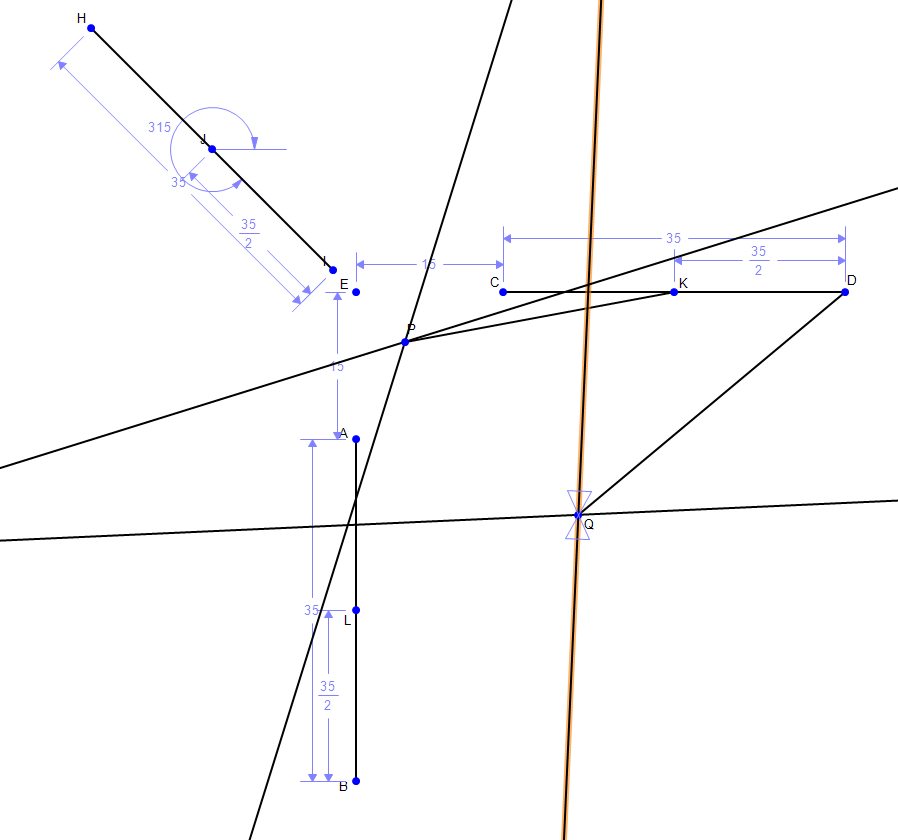
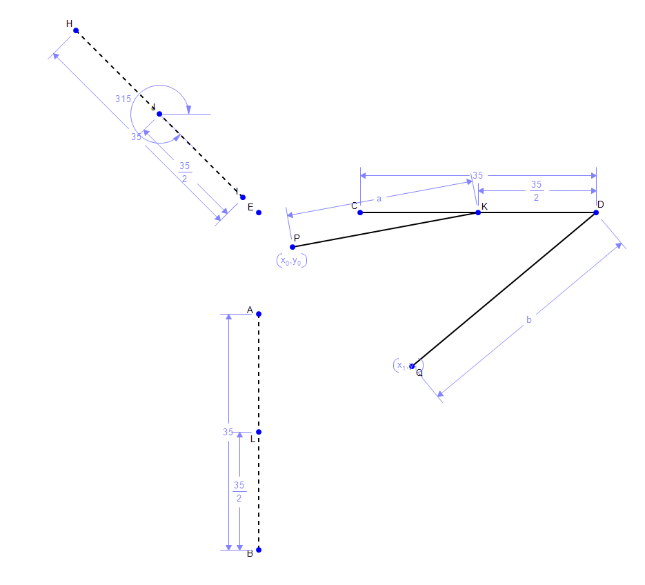

# Container Challenge: Mechanism Synthesis

## Final Motion Result
Below is the final simulation of the trash can lid mechanism, synthesized to follow the required path constraints.

  <video src="videos/TrashCanChallengeSolidWorks.mp4" controls width="80%"></video>

---

## The Synthesis Process

This project required the design of a linkage that moves a tray through specific poses. The full assignment instructions can be found in this [PDF Reference](pdf/ContainerChallenge.pdf).

### 1. Initial Geometry & Constraints
The process began by mapping the dimensions of the container and the required **Start** and **End** poses of the tray.

### 2. Identifying the Midpoint Pose
To successfully engineer the motion, a third "midpoint" constraint pose was required. After iterating through several configurations, I determined that a **45-degree angle** was optimal due to the inherent symmetry of the problem setup.

> **Key Insight:** Adding a midpoint to each tray constraint pose was the breakthrough that allowed the link base pivot positions to remain within the designated "orange zone" clearance area (seen in the first image) throughout the entire motion.

---

## Geometric Construction
Following the principles learned in class, I used perpendicular bisectors between the three points of motion to find the pivot points and determined the required link lengths.

### Linkage Path Logic:
* **Link PK:** The radius and center were determined using points \\( L, J, \\) and \\( K \\).
* **Link QD:** The radius and center were determined using points \\( B, I, \\) and \\( D \\).

### Final Geometry
After locating the pivots, I constrained the lengths for links **PK** and **QD** and fixed their pivot positions. In the final illustration, the intermediate tray constraints are styled as dashed lines to visualize the intended path of travel for tray **CD**.

---

## Final Simulation (Math Illustrations) and SolidWorks Animation
The following video demonstrates the final geometry in motion, confirming that the tray follows the synthesized path.

  <video src="videos/TrashCanChallenge.mp4" controls width="80%"></video>

  <video src="videos/TrashCanChallengeSolidWorks.mp4" controls width="80%"></video>

