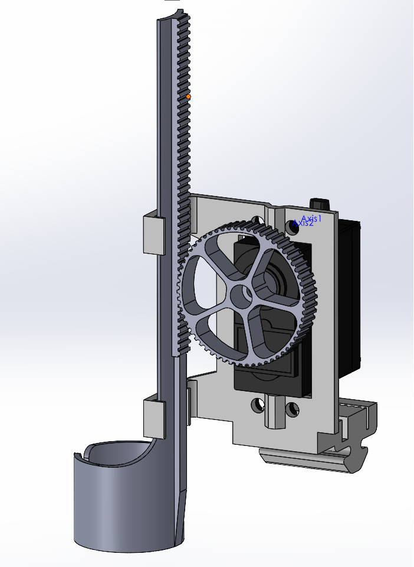
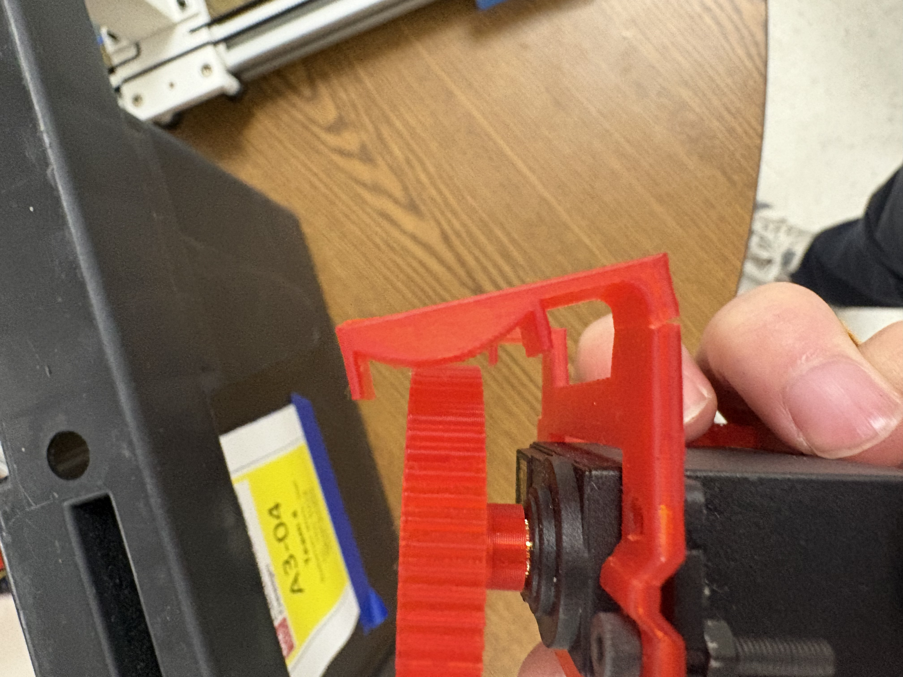
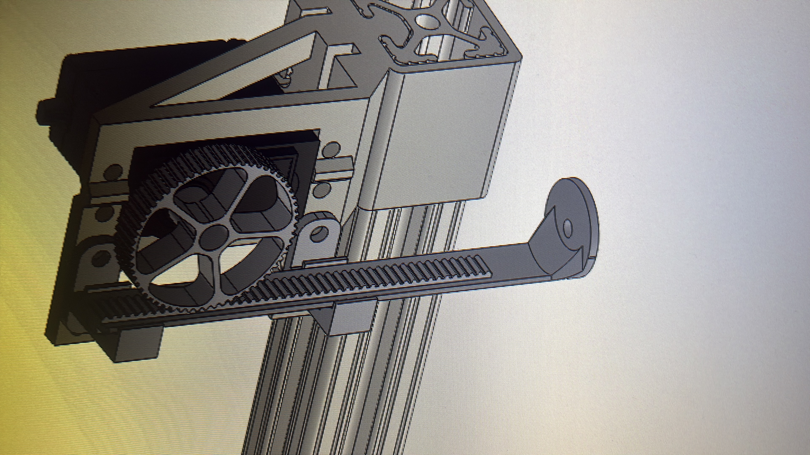
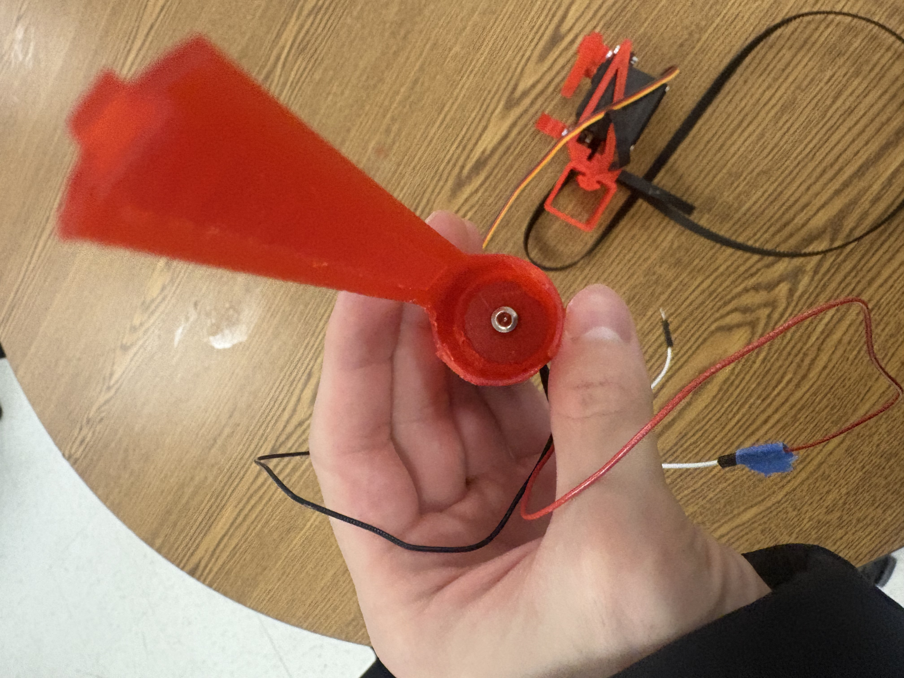
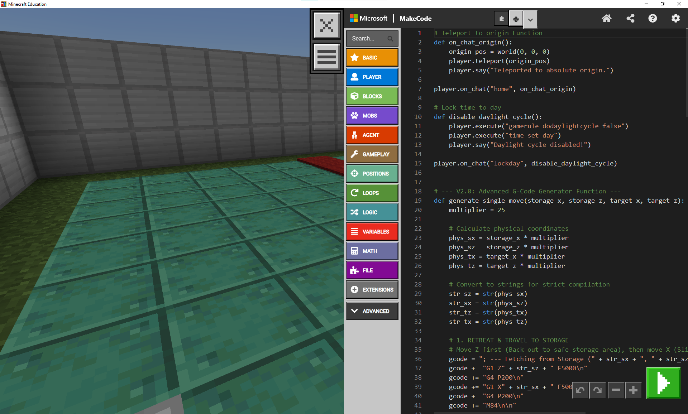

My part of the project involved completing the **rack and gear system for the Z-axis**, the **electromagnet**, the **wiring**, and the **code**.

At first, this is what my rack and gear system looked like. I needed a way to hold the servo, the gear, and the rack. I designed two pieces: a holder for the servo and a separate piece for the rack. The gear was screwed directly onto the servo axle.

The problems with this first design were that the plastic was too thin and it was not printed in the correct orientation to prevent cracks from forming. As the rack was pushed against the gear, the stress caused the layers to delaminate, and that flexing led to breaks:

To fix this, I designed a thicker version with an adjustable rack position to ensure a better fit.

I later realized that we could screw the electromagnet directly onto the rack, looked like this:

Once I finished the rack and gear system, I worked on getting the electromagnet working. I had to search through the G-Code Mashup file on BlackBoard to find the right commands, and I learned that this electromagnet is controlled via Pulse Width Modulation (PWM). This is the reason the magnet sometimes vibrates when it is turned on; the rapid switching between "on" and "off" signals (1s and 0s) vibrates the magnet and the metal attached to it. This led to some problems later where the piece of metal we were trying to attract would slide off the magnet because of the vibration.

I also learned how to get the servo moving up and down using the control board. I used the D11 pins, but when I did this, I realized that my computer would sometimes turn off whenever I ran the servo directly from the MKS board. I assume this happened because the servo was drawing too much current from my laptop's USB port.

  <video src="videos/FinalProject/ServoMotion.mov" controls width="50%"></video>

To solve this, instead of connecting the power for the servo to the MKS board, I decided to draw power from an external Arduino. I knew the servo was rated for approximately 5V, so I took the 5V output from the Arduino and connected it to the servo. I also made sure to connect the grounds of the MKS board and the Arduino to create a common ground. The signal wire from the servo remained connected to the MKS board so that we could still control it via G-code.

Once that was finished, I ran some tests and made a 2D game—not the finished Minecraft version, but just a way to test the system's logic so far.

  <video src="videos/FinalProject/2D_Demo.mp4" controls width="50%"></video>

Next, I needed to wire everything so the setup was more permanent. I mounted the Arduino, MKS board, power cables, motor connections, and all the wiring underneath the acrylic board.

Then, I started working on the Minecraft integration. I found out that there is an educational version of Minecraft that allows users to run custom Python code to extract information from the game. I used this Python code within the game to write data to a file on my desktop. From there, I could extract the positions of the blocks I placed and export convert them into G-code.

Once I figured out how to do this, I created a Python program that detects whenever the G-code file on my desktop is updated. It then automatically sends the G-code to the MKS board connected to my laptop.

This is a video of the project placing 1 block by reading the minecraft game.

  <video src="videos/FinalProject/1block.mov" controls width="50%"></video>

This is a video of the final project placing multiple blocks. I implemented an algorithm to prevent block collision during the build process. It works by scheduling which blocks should be placed first and from what location they need to be picked up from. This is all running on the python script inside Minecraft educational edition, which generates the gcode.

  <video src="videos/FinalProject/multiBlock.mp4" controls width="50%"></video>

