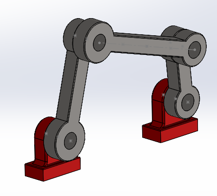
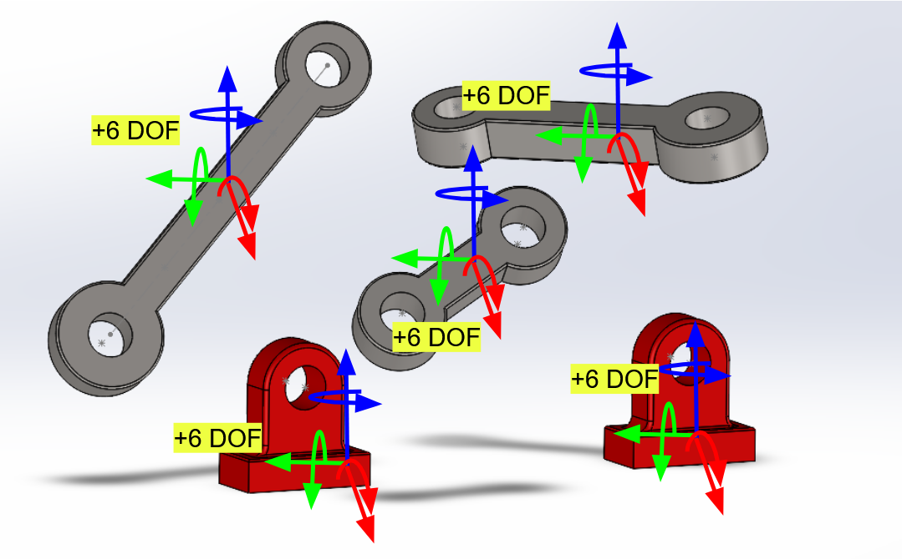
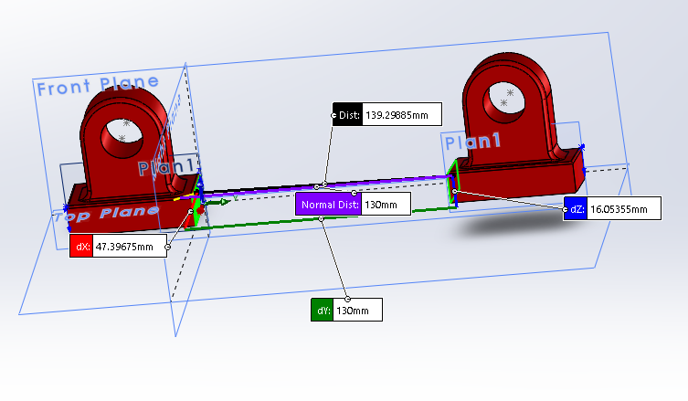
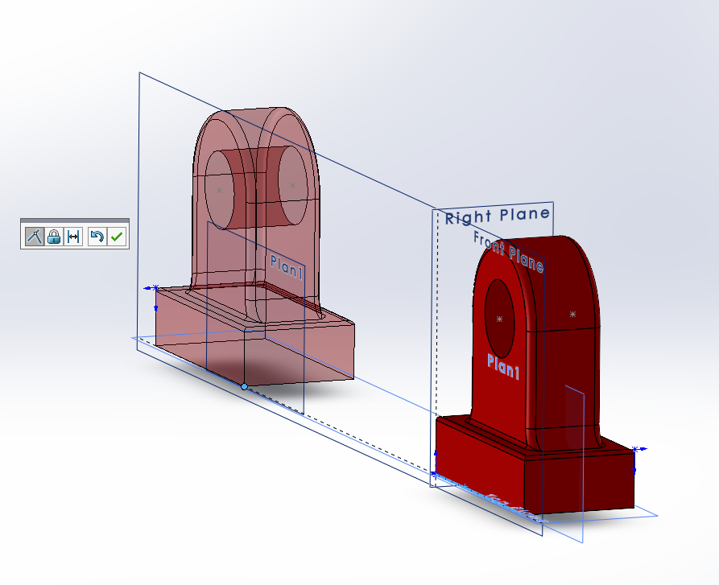
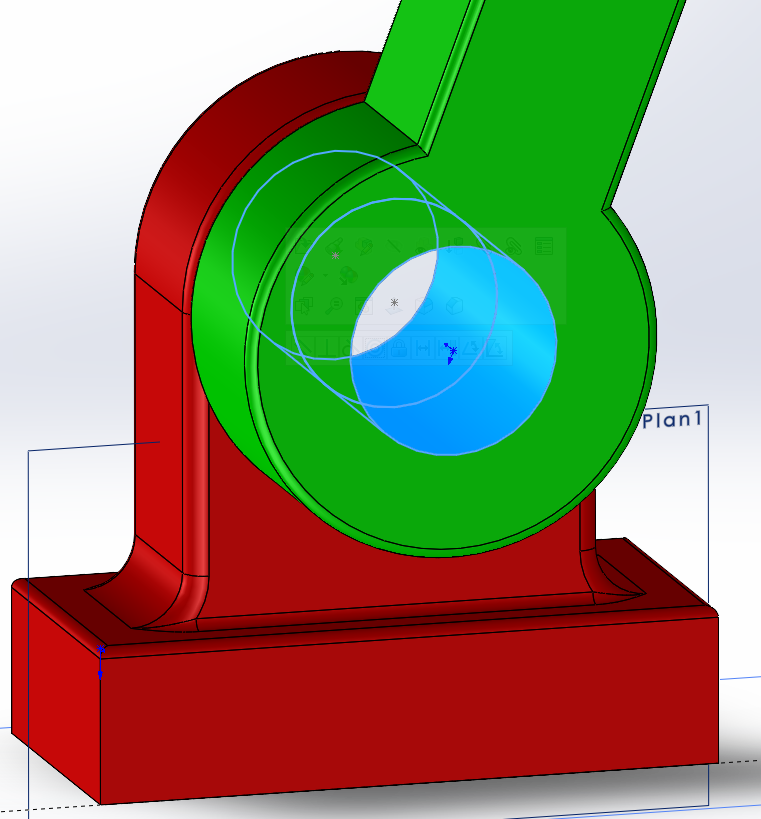
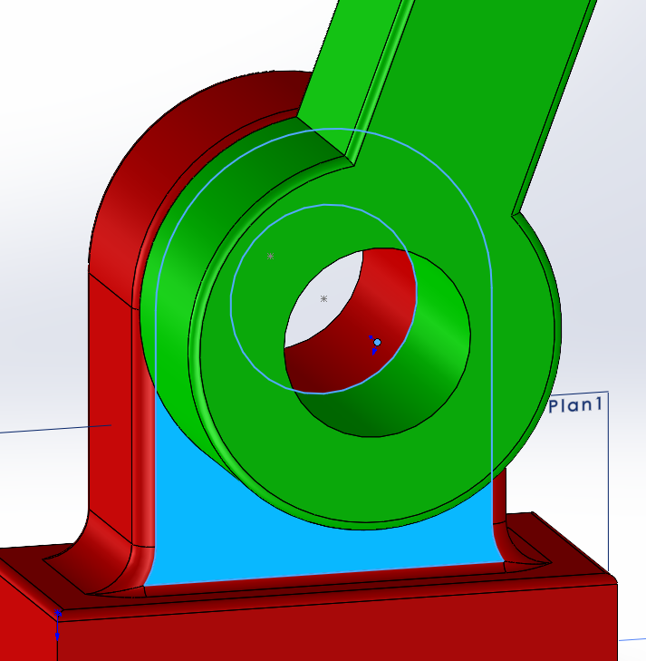
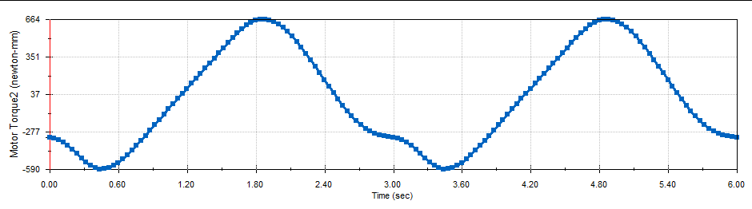
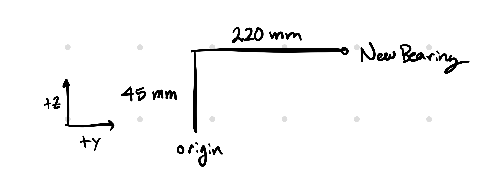
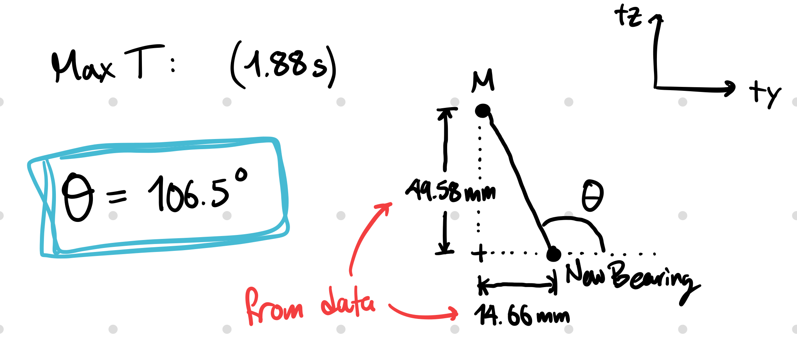
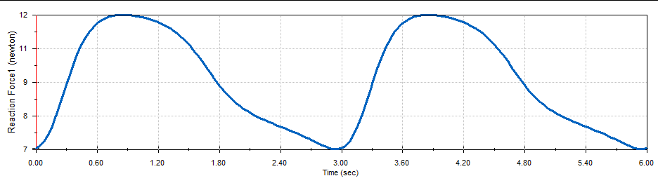

# Four-Bar Mechanism Analysis in SolidWorks

## Summary
This project explores the principles of **Degree of Freedom (DOF)** within a SolidWorks assembly and extracting data such as forces, torques, and power from a motion study.

### Final Results

| Parameter | Value |
| :--- | :--- |
| **Max Motor Torque** | \\(664.3 \text{ N}\cdot\text{mm}\\) |
| **Max Torque Crank Angle** | \\(106.5^\circ\\) (Relative to RHS setup) |
| **Max Vertical Force (Bearing)** | \\(10.76 \text{ N}\\) |
| **Max Vertical Force (NewBearing)** | \\(12.17 \text{ N}\\) |
| **Min Power (20 RPM)** | \\(1.39 \text{ W}\\) |

> **Note on Negative Torque:** Negative motor torque values indicate intervals where the mechanism's inertia or gravity drives the motor. In these moments, gravity assists the rotation, effectively relieving the motor of the workload.

---

## Degree of Freedom (DOF) Calculation
A system of 5 unconstrained components begins with **30 DOF** (6 per part). To reach a final state of 1 DOF, we must systematically remove 29 degrees of freedom.

### 1. Establishing the Ground: Bearing
To fix the first bearing in space, exactly **6 DOF** were removed:
* **Point-to-Origin (-3 DOF):** Constraining one corner to the origin fixes translation.
* **Point-to-Axis (-2 DOF):** Constraining a second corner to an axis fixes two rotational axes.
* **Point-to-Plane (-1 DOF):** Constraining a third point to the top plane removes the final rotation.

  <video src="videos/pointToOrigin.mp4" controls width="45%"></video>
  <video src="videos/pointToAxis.mp4" controls width="45%"></video>

### 2. Positioning the Second Bearing
For the second bearing, I applied distance and alignment constraints to remove another **6 DOF**:
* **Distance Constraint (-2 DOF):** Functions as a parallel plane-to-plane mate.
* **Colinear Constraints (-4 DOF):** Constraining two corners to be colinear with the edges of the first bearing. 

  
  

### 3. Kinematic Linkage Assembly
With the bearings fixed, the remaining 3 links possess **18 DOF**. I targeted a final result of 1 DOF using rotational joints.

**Joints 1–3 (-15 DOF):**
Each joint is created by:
* **Concentric Mate (-4 DOF):** Aligning cylindrical surfaces.
* **Coincident Mate (-1 DOF):** Matching the rotation point to the link plane.

  
  

**Final Joint (-2 DOF):**
At the final connection to the second bearing, only 3 DOF remained. To reach the **1 DOF target**, I used a **Point-to-Line** (axis of rotation) mate rather than a full concentric mate, which removes the final 2 necessary degrees of freedom.

---
## Motion Analysis & Traces
With the assembly constrained to 1 DOF, a motor was added at a constant **20 RPM**.

### Path Traces
The following videos show the coupler curves at different points along the bar:

| 1/4 Length Trace | 1/2 Length Trace |
| :--- | :--- |
| <video src="videos/4BarMotionPlotFourth.mp4" controls width="100%"></video> | <video src="videos/4BarMotionPlotHalf.mp4" controls width="100%"></video> |

---

## Force & Torque Analysis

### Motor Torque
The maximum motor torque recorded was **\\(664.3 \text{ N}\cdot\text{mm}\\)**.

<video src="videos/MotorTorqueVideo.mp4" controls width="100%"></video>
The timing of the maximum torque makes sense because it occurs exactly when the LHS is fully extended, and there is minimal momentum due to gravity to help the rotation.
### Crank Angle Calculation
The maximum torque occurs at **\\(t = 1.88\text{s}\\)**. Because the bearing was not centered at the origin, I calculated the true midpoint relative to the bearing axis by subtracting the displacement (\\(\Delta x, \Delta y\\)):

\\[\theta = \arctan\left(\frac{y - \Delta y}{x - \Delta x}\right)\\]

  
  
  

### Reaction Forces
The vertical reaction forces were analyzed for both bearings:
* **NewBearing Max Vertical Force:** \\(12.17 \text{ N}\\)
* **Bearing Max Vertical Force:** \\(10.76 \text{ N}\\)

| NewBearing Force | Original Bearing Force |
| :--- | :--- |
|  |  |

---

## Power Consumption
To maintain a consistent 20 RPM, the motor must handle the peak power demand. Based on the power consumption plot, the minimum required power is **\\(1.39 \text{ W}\\)**.

<video src="videos/PowerConsumptionVideo.mp4" controls width="100%"></video>